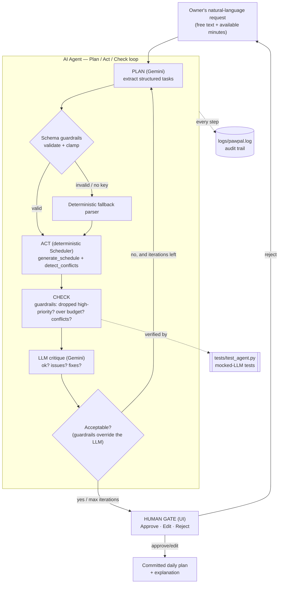

# PawPal+ — System Architecture

PawPal+ is an **applied AI system** that turns a pet owner's plain-English
description of care needs into a verified daily schedule. The novelty is an
**agentic workflow**: the AI **plans**, **acts**, and **checks its own work**
in a capped loop, with a human approving before anything is committed.

## Design principle (the trust story)

> **The LLM does language and judgment. The deterministic engine does the math.**

The LLM (Gemini) only *reads* free text and *critiques* a plan. It never
computes times, totals, or conflicts — the verified `Scheduler` in
`pawpal_system.py` does that. So the AI can never invent time that isn't there,
and every schedule is reproducible and checkable by hand.

## Components

| Component | File | Responsibility |
|-----------|------|----------------|
| **Agent orchestrator** | `agent/planner.py` | Runs the Plan → Act → Check → Revise loop |
| **LLM client** | `agent/llm_client.py` | Gemini wrapper; JSON output; retry; degrades if no key |
| **Schema guardrails** | `agent/schemas.py` | Validates/clamps every LLM response before use |
| **Prompts** | `agent/prompts.py` | Versioned PLAN + CRITIQUE templates |
| **Deterministic fallback** | `agent/fallback.py` | Keyword parser used when Gemini is unavailable |
| **Scheduling engine** | `pawpal_system.py` | Source of truth: ranks + time-boxes tasks |
| **Config** | `config.py` | Loads `.env`; key, model, loop/task caps |
| **Logging** | `logging_config.py` | Audit trail to `logs/pawpal.log` |
| **UI** | `app.py` | NL input + trace + human Approve/Edit/Reject gate |
| **CLI demo** | `agent_demo.py` | End-to-end trace in the terminal |
| **Tests** | `tests/test_agent.py` | Offline tests with a mocked LLM |

## Data flow (input → process → output)

## Where humans and testing check the AI

- **Human gate (UI).** The Streamlit app shows the full Plan/Act/Check trace and
  self-check verdict, then the owner must **Approve**, **Edit**, or **Reject**.
  No AI plan is committed without a human.
- **Deterministic guardrails.** `agent/schemas.py` validates and clamps every LLM
  response; `agent/planner.py` computes objective findings (dropped high-priority
  tasks, over-budget totals, time conflicts) that **override** the LLM's own
  verdict — if the checker finds a problem, the plan is marked *needs revision*
  even if the model claimed it was fine.
- **Automated tests.** `tests/test_agent.py` runs the whole loop with a mocked LLM
  (no network), covering the fallback path, convergence, the guardrail override,
  and the revise loop.
- **Audit log.** Every Plan/Act/Check step is written to `logs/pawpal.log`
  (secrets excluded), so a reviewer can reconstruct exactly what the agent did.

## Responsible design / guardrails

- LLM output is schema-validated and clamped (duration 1–240, known priorities,
  capped task count) before it touches the scheduler.
- The loop is capped (`PAWPAL_MAX_ITERATIONS`, default 3) — no runaway.
- Every API/parse error is caught and logged; the system degrades to the
  deterministic fallback instead of crashing, so it always runs reproducibly.
- The API key is read only from `.env` (gitignored) and is never printed or logged.
- A human approves before any AI-produced plan is committed.
